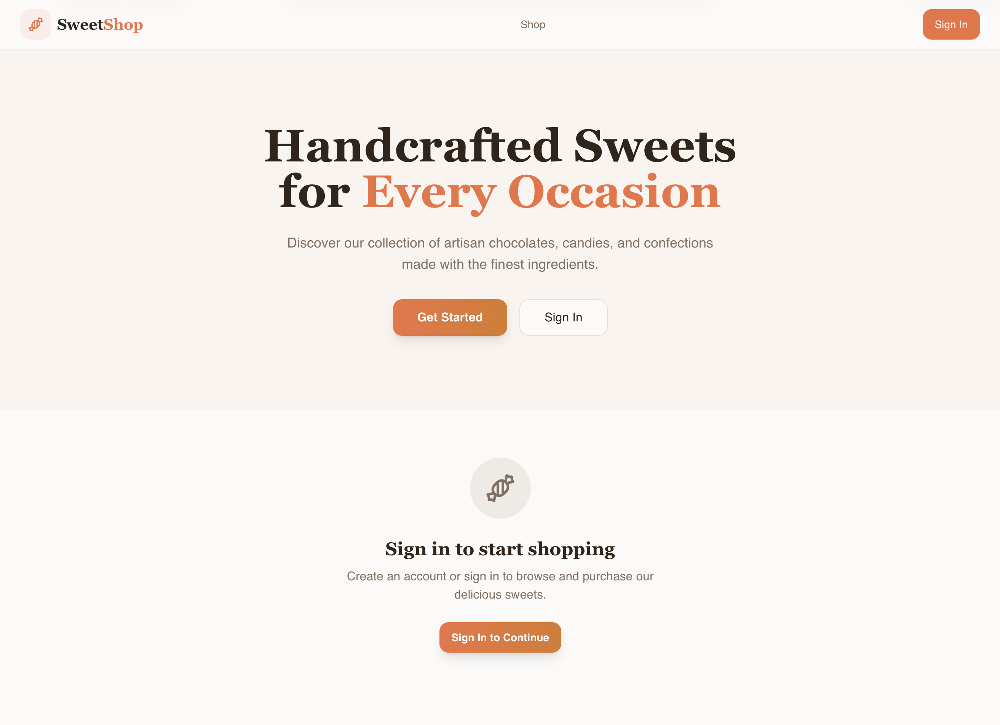
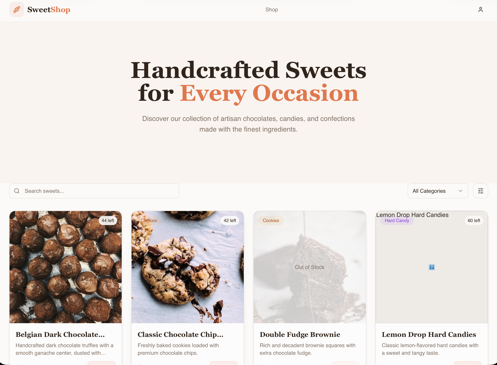

# 🚀 Project Title

🔗 **Public Repository:**  
<https://github.com/rajkunal024/sweet-shop-dashboard.git>

---

## 📌 Project Overview

This is a modern frontend web application built using **React + TypeScript** and powered by **Vite** for fast development and optimized builds.  
The project uses **Tailwind CSS** and **shadcn-ui** to create a clean, responsive, and reusable UI component system.

The goal of this project is to demonstrate:
- Component-based UI development
- Modern frontend tooling
- Clean project structure
- Best practices in React & TypeScript

---

## 🛠️ Technologies Used

This project is built with:

- **Vite** – Fast development & build tool
- **React** – Component-based UI library
- **TypeScript** – Type-safe JavaScript
- **Tailwind CSS** – Utility-first CSS framework
- **shadcn-ui** – Prebuilt, customizable UI components
- **Node.js & npm** – Dependency management

---

## ⚙️ Setup & Run Instructions (Frontend)

### Prerequisites
Make sure you have the following installed:
- **Node.js (v18+)**
- **npm**
  
You can install Node.js using **nvm**:  
👉 https://github.com/nvm-sh/nvm#installing-and-updating

---

# Application Login page


# Main Page

### 🚀 Run Locally Using Your IDE
---

```sh
# Step 1: Clone the repository
git clone <https://github.com/rajkunal024/sweet-shop-dashboard.git>

# Step 2: Navigate into the project directory
cd < Sweet Shop Dashboard >

# Step 3: Install dependencies
npm install

# Step 4: Start the development server
npm run dev

